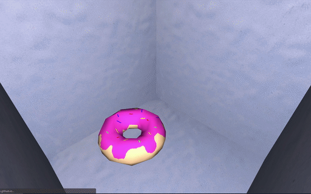

# Finite Element Method. 

# Based on Fast Corotated FEM using Operator Splitting by Tassilo Kugelstadt et al.

You need to put Eigen 3.3.8 in include/Eigen/Eigen.

Try it out! https://galoko.github.io/FEM_WASM/

